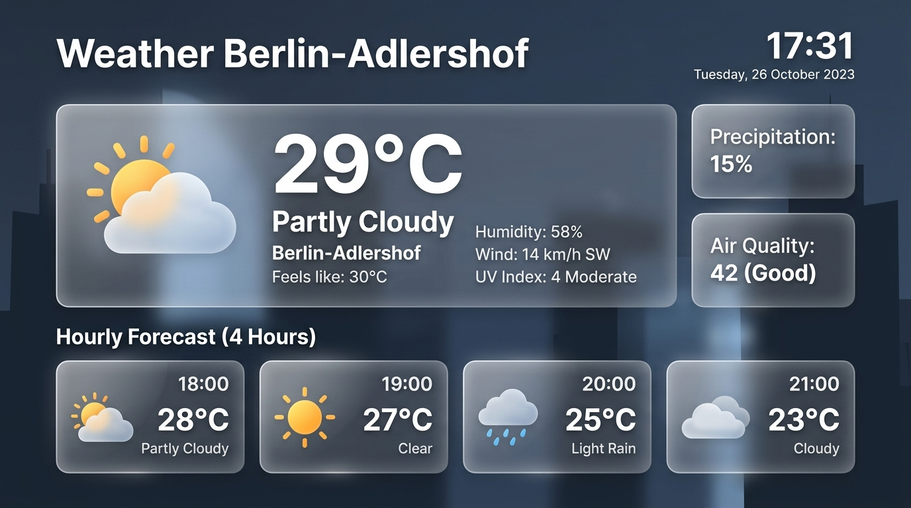
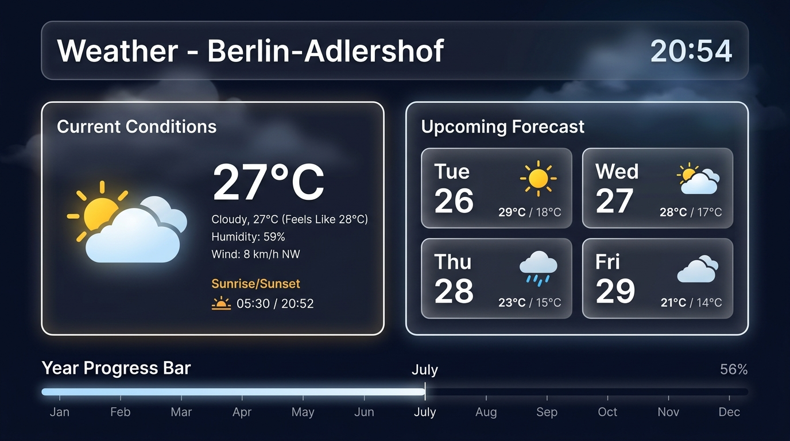
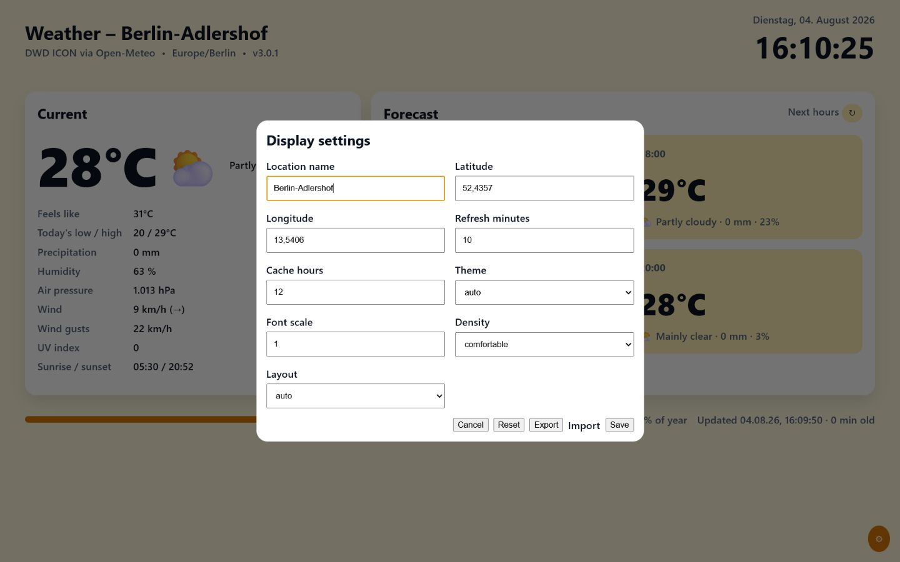
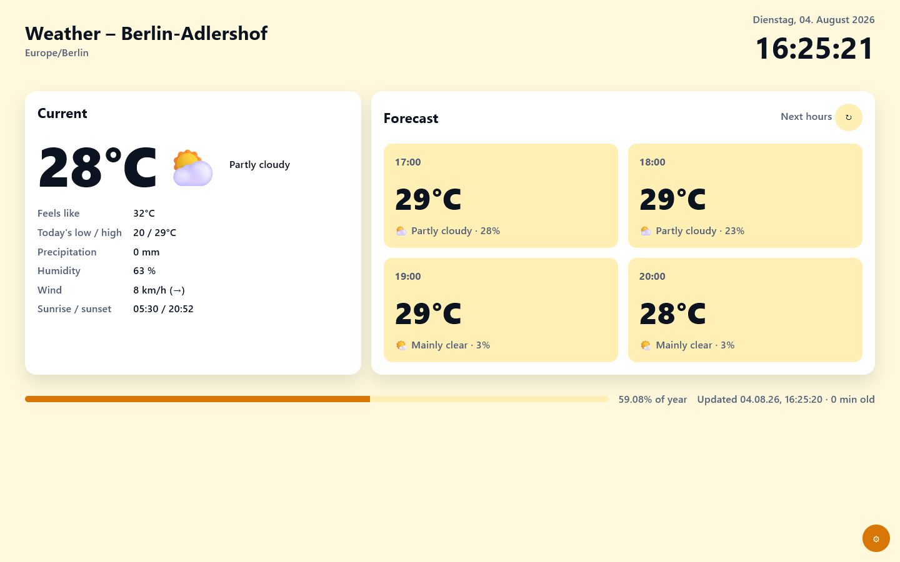
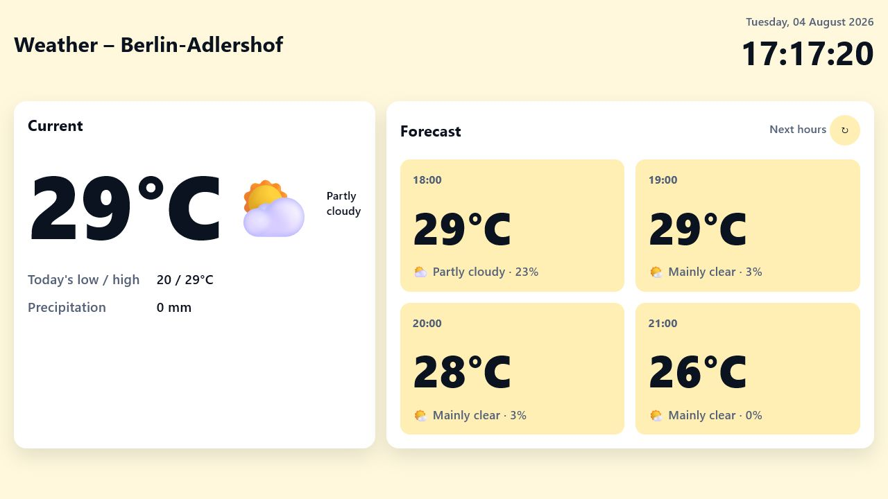

# Weather Info Display

A backend-free weather dashboard designed for an unattended browser in kiosk mode. It uses the high-resolution DWD ICON forecast through Open-Meteo, ships as static files, and requires no API key.

Berlin-Adlershof is the included example location. You can change it without rebuilding the application.

## Screenshots

### Kiosk overview



The default desktop layout presents the current conditions, four upcoming hours, a live clock, data age, and year progress at a glance.

### Daily forecast



The forecast card switches automatically or manually between the next four hours and the next four days.

### Display settings



Location, refresh and cache intervals, theme, font scale, density, and layout can be changed directly on the display. Settings are stored only in the local browser and can be exported or imported as JSON.

> The screenshots show live forecast data captured for the Berlin-Adlershof example. Values and the adaptive theme change with time and weather conditions.

### Reduced information modes

| Essential                                                                        | Glance                                                                          |
| -------------------------------------------------------------------------------- | ------------------------------------------------------------------------------- |
|  |  |

Choose **Essential** for a quieter wall display or **Glance** for maximum readability from a distance. The original full view remains available as **Detailed**.

## Features

- Current conditions and alternating hourly/daily forecast
- Daily low/high, wind gusts, UV index, full date, and explicit data age
- Automatic light/dark theme based on sunrise and sunset
- Four adaptive day-phase themes, manual forecast switching, and kiosk display profiles
- Responsive kiosk layout for tablets and desktop displays
- Detailed, essential, and distance-optimized glance information modes
- Cached last-known-good data when the network or API is unavailable
- Automatic refresh, timeout, and retry handling
- URL-based location configuration
- Provider abstraction with proxy-ready DWD, MET Norway, and OpenWeather profiles
- GitHub Pages deployment and pull-request quality checks
- Running and latest GitHub release versions shown directly on the display
- Configurable year progress as percentage, elapsed days, both, or hidden
- Viewport- and capability-aware device profiles with manual scale and width overrides
- Uniform or per-side pixel spacing for kiosk bezels, overscan, and asymmetric mounting frames
- Configurable secondary-information dimming or auto-hide with persistent critical status notices
- Thematically grouped, keyboard-accessible settings tabs
- Complete German/English runtime localization and three offline icon packs
- No cookies, analytics, account, backend, or secrets

## Quick start

Static ES modules must be served over HTTP; opening `index.html` directly with `file://` is not supported.

```sh
python -m http.server 8080
```

Open <http://localhost:8080>.

## Configuration

Edit [`config.js`](config.js) to change the permanent defaults. Adlershof remains the shipped example:

```js
latitude: 52.4357,
longitude: 13.5406,
locationName: "Berlin-Adlershof",
timezone: "Europe/Berlin",
locale: "de-DE",
```

For one display, override the location in its kiosk URL:

```text
https://example.github.io/repository/?lat=53.5511&lon=9.9937&name=Hamburg&timezone=Europe/Berlin
```

Supported parameters are `lat`, `lon`, `name`, `timezone`, and `locale`. Invalid coordinates are ignored. Use an [IANA timezone name](https://en.wikipedia.org/wiki/List_of_tz_database_time_zones).

`locale` controls date, time, and number formatting, not the interface language. The repository and interface remain English; `de-DE` is the appropriate default formatting locale for the Berlin-Adlershof example. Unsupported locale and timezone overrides are ignored safely.

## Kiosk mode

Microsoft Edge on Windows:

```powershell
msedge.exe --kiosk "https://example.github.io/repository/" --edge-kiosk-type=fullscreen --no-first-run
```

Google Chrome:

```powershell
chrome.exe --kiosk "https://example.github.io/repository/" --no-first-run --disable-session-crashed-bubble
```

Configure the operating system to start the browser after login and to keep the display awake. Test recovery after disconnecting and reconnecting the network before leaving the display unattended.

## Data source decision

The project intentionally keeps Open-Meteo's dedicated DWD ICON endpoint.

- **Open-Meteo DWD ICON (selected):** browser-friendly JSON, no key for non-commercial use, CORS support, and automatic combination of ICON-D2 (~2 km), ICON-EU, and ICON Global forecasts.
- **Direct DWD Open Data:** authoritative source, but primarily distributed as GRIB2 files. Parsing and spatial extraction require a backend or build pipeline, which conflicts with this static deployment.
- **Bright Sky:** an excellent simple DWD JSON API for station observations and MOSMIX forecasts, but it does not improve this display's forecast use case enough to justify changing providers.

For commercial use, check the current Open-Meteo licensing and pricing terms. Attribution to DWD and Open-Meteo remains visible in the interface.

Alternative provider profiles are prepared but disabled by default. Direct DWD Open Data requires GRIB2 processing, MET Norway requires an identified server-side client and has browser CORS constraints, and OpenWeather requires an API key. Keys must never be placed in this static application. See [Weather provider integration](docs/WEATHER_PROVIDERS.md) for the proxy contract and activation instructions.

Version 3 includes a deployable Cloudflare Worker proxy with MET Norway and OpenWeather adapters plus a controlled DWD ingestion-service hook. It remains inactive until the operator supplies external hosting and any required secrets.

Before enabling it, review the complete [Package E prerequisites and go-live checklist](docs/WEATHER_PROVIDERS.md#prerequisites). The default display requires none of this proxy infrastructure.

## CI/CD and deployment

`quality.yml` runs linting, formatting checks, tests, and a live API smoke test on pushes and pull requests. `deploy-pages.yml` publishes the exact static files to GitHub Pages after quality checks pass on `main`.

To enable deployment:

1. Open the repository on GitHub.
2. Go to **Settings → Pages**.
3. Set **Source** to **GitHub Actions**.
4. Push to `main` or run the deployment workflow manually.

No repository secret is required. Pull requests do not deploy.

## Development

Requires Node.js 24 or newer.

```sh
npm ci
npm test
npm run lint
npm run format:check
npm run validate:site
npm run smoke
```

`npm run smoke` contacts the production weather API. The other checks run locally without network access.

## Privacy and resilience

The browser contacts only `api.open-meteo.com`. The latest successful response is stored in browser `localStorage` for up to 12 hours. It contains public forecast data and the configured location, not personal data. If no usable cache exists, the page remains visible with an error state and retries automatically.

## Legacy Apps Script migration

Version 2 removes `Code.gs` and `appsscript.json`. Configuration, weather response mapping, caching, and retries now run in the browser. Existing Apps Script deployments can remain online while the static URL is tested, then be retired.

## License

[MIT](LICENSE)
