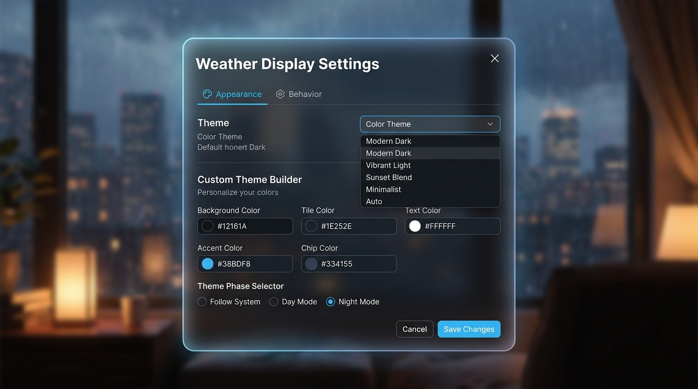

# Local settings

Open the gear button to adjust the kiosk locally. Settings are stored only in browser `localStorage` and override `config.js`; URL location parameters remain the final override. Reset removes the local override. Export/import transfers the allow-listed non-secret settings as JSON.

The dialog groups controls into four keyboard-accessible tabs:

- **Location & data:** location, coordinates, refresh interval, and cache duration
- **Display:** detected capabilities, device profile, layout, information density, and scaling
- **Appearance & behavior:** color theme selection, custom theme builder, 5 day-phase overrides, forecast rotation, icon pack, and year-progress presentation
- **Backup & reset:** JSON export/import and restoring defaults

## Color themes, custom builder, and 5 day phases

Choose from 8 built-in color themes or build a custom palette:

- **Sky Glass (Default):** Atmospheric blue and cyan glassmorphism layout
- **Cyberpunk Neon:** Vibrant cyan, pink, and synthwave purple neon aesthetic
- **Nordic Slate:** Polar ice teal and cool slate grey palette
- **Forest Aurora:** Emerald green and golden sun canopy theme
- **Sunset Coral:** Rich peach, coral orange, and twilight violet theme
- **Minimal Dark:** Restrained monochrome dark grey design
- **Minimal Light:** Clean paper-white minimal light design
- **High Contrast:** High-contrast black and yellow accessibility theme
- **Custom Theme Builder:** Select **Custom Theme Builder** to reveal color pickers for background, tile card, text color, accent color, and badge chip colors. Custom themes are saved in browser storage and exported/imported via JSON backup.

Every theme seamlessly integrates with all **5 day phases** (**Morning**, **Noon**, **Afternoon**, **Evening**, **Night**). Choose **auto** under **Theme phase** to automatically cycle phases based on local sunrise and sunset times, or select a specific phase to pin it permanently.

## Layout structure modes (8 Variants)

Customize your display arrangement under **Appearance & behavior** (Design & Verhalten):

- **Standard Kiosk Grid (Default):** Balanced two-column grid layout with current conditions on the left and forecast on the right.
- **Hero Header & Bottom Cards (Bild 1):** Prominent hero weather header with giant temperature readout and a full-width bottom row of 7-day forecast cards.
- **Smart Display Grid (Bild 2):** Echo Show / Nest Hub style modular dashboard layout with main weather and key metric cards.
- **Split Columns (Vertikal):** Symmetrical 50/50 vertical column split for portrait displays or split kiosks.
- **Compact Banner Bar:** Ultra-widescreen horizontal strip layout for wide monitors or header displays.
- **Focused Hero Deck:** Centered single-column focus card with subtle elevation shadows.
- **Magazine Editorial & Weather Story:** Editorial magazine layout with bold weather typography and highlight metrics.
- **Ambient Room Clock & Weather Strip:** Large room clock header focus with sleek ambient weather strip.

## Background image & card transparency

Personalize your kiosk with custom background imagery:

- **Layout Structure Mode:** Choose between **Standard Kiosk Grid**, **Hero Header & Bottom Cards**, **Smart Display Grid**, **Split Columns**, **Compact Banner Bar**, **Focused Hero Deck**, **Magazine Editorial**, **Ambient Room Clock**, or **Top Centered Clock & Grid**.
- **Sunrise & sunset times:** Toggle visibility of local sunrise and sunset times (`Visible` or `Hidden`) rendered with dedicated vector icons (🌅 / 🌇).
- **Opacity Slider:** Fine-tune glass card transparency (`--tile-opacity`) from 10% to 100% for optimal contrast over background pictures.

| Display and edge controls                       | Appearance and behavior controls                       |
| ----------------------------------------------- | ------------------------------------------------------ |
|  |  |

Use `Left Arrow` and `Right Arrow` to move between tabs, or `Home` and `End` to jump to the first or last tab. The active tab and keyboard focus remain visibly distinct, following the [WAI-ARIA tabs pattern](https://www.w3.org/WAI/ARIA/apg/patterns/tabs/).

Never store API keys in settings. Provider credentials belong in the controlled proxy described in [WEATHER_PROVIDERS.md](WEATHER_PROVIDERS.md).

## Language and weather icons

Choose **Deutsch** or **English** under **Appearance & behavior**. The language changes the complete runtime interface, weather descriptions, status messages, accessibility labels, dates, times, and number formatting. Repository documentation and source code remain English.

Four Meteocons SVG styles are bundled locally and work offline:

| Pack         | Presentation                                   | Recommended use                   |
| ------------ | ---------------------------------------------- | --------------------------------- |
| **Fill**     | Rich color, gradients, and strongest hierarchy | Default kiosk and wall display    |
| **Flat**     | Quiet color without gradients                  | Restrained or lower-power display |
| **Outline**  | Clean line artwork                             | Minimal interface with clear form |
| **Animated** | Slowly moving color artwork                    | Optional ambient display          |

All packs cover the same WMO weather-code mapping and use distinct day/night artwork where appropriate. Animated icons automatically fall back to static Fill icons when the browser reports `prefers-reduced-motion: reduce`. Only the required icon subset is included, and every asset is cached by the service worker for offline pack switching. Licensing and attribution are recorded in [Third-party notices](../THIRD_PARTY_NOTICES.md).

## Information modes

| Mode          | Best for                      | Visible information                                                                                                   |
| ------------- | ----------------------------- | --------------------------------------------------------------------------------------------------------------------- |
| **Detailed**  | Desks and close viewing       | All current measurements, precipitation amounts, forecast probabilities, and technical version metadata               |
| **Essential** | Wall tablets and shared rooms | Core conditions plus feels-like temperature, humidity, wind, sunrise/sunset, and forecast probability                 |
| **Glance**    | TVs and distant kiosk viewing | Large temperature, condition, daily range, precipitation, forecast condition/probability, clock, and offline warnings |

The modes change information hierarchy without changing the underlying weather request. Font scale and density remain independent controls, so each profile can be tuned for the physical screen and viewing distance.

Set **Forecast rotation** to **Manual only** when changing content would make the display harder to follow. The forecast switch remains available as a large touch target.

## Year progress

The footer can show **Percentage and days**, **Percentage only**, **Days only**, or be **Hidden**. The combined default looks like `58.90% of year · Day 216 of 365`. Changes are previewed immediately behind the settings dialog; **Cancel** restores the saved presentation and **Save settings** persists it. Leap years are detected automatically and use 366 as the total. The bar always visualizes elapsed year progress proportionally, even when its text label uses days.

## Secondary information

Provider attribution, timezone, installed and GitHub versions, routine data freshness, and year progress are secondary information. Choose **Always visible**, **Dim after inactivity**, **Hide after inactivity**, or **Important only** under **Appearance & behavior**. The dim/hide delay accepts 3–300 seconds and resets on pointer, touch, or keyboard activity.

The default is **Hide after inactivity** after 15 seconds. Available updates and offline, cached-data, or error messages remain visible regardless of the selected mode. Reduced-motion browser preferences disable the opacity transition.

## Display detection and manual overrides

With **Device profile** set to **Auto-detect**, the application classifies the current CSS viewport as phone, tablet, desktop, or large TV/kiosk and recalculates the layout whenever the browser window or screen orientation changes. It also detects coarse-pointer, hover, device-pixel-ratio, service-worker, and fullscreen capabilities. It does not use the user-agent string or collect a hardware fingerprint.

The settings dialog shows the detected viewport and capabilities. Override the automatic result with **Phone**, **Tablet**, **Desktop**, or **TV / kiosk** when the physical viewing situation differs from the viewport heuristic.

- **Display scale** applies a global 75–150% visual scale on top of the existing font scale.
- **Content width** limits the dashboard to 70–100% of the viewport.
- **Edge spacing** reserves 0–500 CSS pixels between the browser edges and the dashboard. Choose **All sides together** for one shared value or **Each side individually** for separate top, right, bottom, and left values. The settings button follows the right and bottom spacing so it stays inside the visible frame.
- **Layout**, **Density**, **Information mode**, and **Font scale** remain independent controls.

Automatic detection uses standards-based [CSS media features](https://developer.mozilla.org/en-US/docs/Web/CSS/Guides/Media_queries) and progressive [feature detection](https://web.dev/learn/pwa/foundations), avoiding unreliable browser-name assumptions.

The profiles follow practical accessibility principles: strong text contrast, scalable text, touch controls at least 44 CSS pixels in size, a reduced-motion fallback, and fewer competing elements in distance-viewing modes.

Reference guidance:

- [WCAG 2.2 contrast and text resizing](https://www.w3.org/TR/WCAG22/#distinguishable)
- [WCAG target size (enhanced)](https://www.w3.org/WAI/WCAG22/Understanding/target-size-enhanced)
- [WCAG pause, stop, hide](https://www.w3.org/WAI/WCAG22/Understanding/pause-stop-hide.html)
- [GOV.UK responsive type scale](https://design-system.service.gov.uk/styles/type-scale/)
